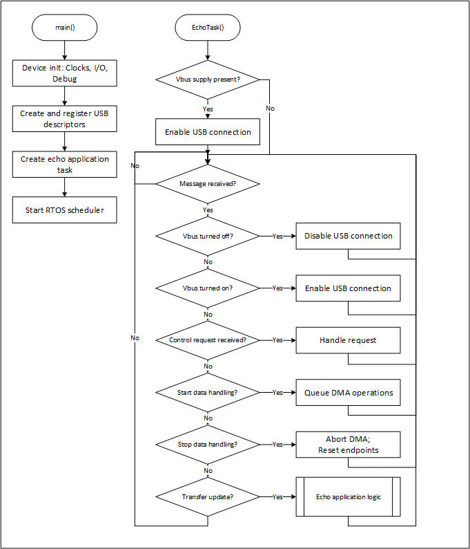

# EZ-USB&trade; FX20: USBSS device application

This code example demonstrates the implementation of a vendor-specific USB device that allows testing of data transfers using the Bulk, Interrupt, and Isochronous endpoints on USB 3.2 Gen1/Gen2 and USB 2.x interfaces. The application demonstrates how a device implementation with multiple alternate settings for an interface can be created for this purpose. This application is designed to work with a generic USB driver on the host side (WinUSB or CyUSB3 under Windows, LibUsb under Linux and macOS). The application implements either a data loopback function or a data source/sink function based on the selected compile-time configuration.

> **Note:** This code example is applicable for EZ-USB&trade; FX20, EZ-USB&trade; FX10, EZ-USB&trade; FX5N, and EZ-USB&trade; FX5 devices.

> **Note:** This code example is targeted to demonstrate the different USB transfer modes (Bulk, Interrupt, and Isochronous) and not for maximum data transfer throughput demonstration. 

[View this README on GitHub.](https://github.com/Infineon/mtb-example-fx20-usbss-device)

[Provide feedback on this code example.](https://cypress.co1.qualtrics.com/jfe/form/SV_1NTns53sK2yiljn?Q_EED=eyJVbmlxdWUgRG9jIElkIjoiQ0UyNDA4NzIiLCJTcGVjIE51bWJlciI6IjAwMi00MDg3MiIsIkRvYyBUaXRsZSI6IkVaLVVTQiZ0cmFkZTsgRlgyMDogVVNCU1MgZGV2aWNlIGFwcGxpY2F0aW9uIiwicmlkIjoic3VrdSIsIkRvYyB2ZXJzaW9uIjoiMS4wLjIiLCJEb2MgTGFuZ3VhZ2UiOiJFbmdsaXNoIiwiRG9jIERpdmlzaW9uIjoiTUNEIiwiRG9jIEJVIjoiV0lSRUQiLCJEb2MgRmFtaWx5IjoiU1NfVVNCIn0=)


## Requirements

- [ModusToolbox&trade;](https://www.infineon.com/modustoolbox) v3.4 or later (tested with v3.4)
- Board support package (BSP) minimum required version: 4.3.3
- Programming language: C


## Supported toolchains (make variable 'TOOLCHAIN')

- GNU Arm&reg; Embedded Compiler v11.3.1 (`GCC_ARM`) – Default value of `TOOLCHAIN`
- Arm&reg; Compiler v6.22 (`ARM`)


## Supported kits (make variable 'TARGET')

- [EZ-USB&trade; FX20 DVK](https://www.infineon.com/fx20) (`KIT_FX20_FMC_001`) – Default value of `TARGET`


## Hardware setup

This example uses the board's default configuration. See the kit user guide to ensure that the board is configured correctly.


## Software setup

See the [ModusToolbox&trade; tools package installation guide](https://www.infineon.com/ModusToolboxInstallguide) for information about installing and configuring the tools package.

Install a terminal emulator if you do not have one. Instructions in this document use [Tera Term](https://teratermproject.github.io/index-en.html).

This example requires no additional software or tools.


## Using the code example


### Create the project

The ModusToolbox&trade; tools package provides the Project Creator as both a GUI tool and a command line tool.

<details><summary><b>Use Project Creator GUI</b></summary>

1. Open the Project Creator GUI tool

   There are several ways to do this, including launching it from the dashboard or from inside the Eclipse IDE. For more details, see the [Project Creator user guide](https://www.infineon.com/ModusToolboxProjectCreator) (locally available at *{ModusToolbox&trade; install directory}/tools_{version}/project-creator/docs/project-creator.pdf*)

2. On the **Choose Board Support Package (BSP)** page, select a kit supported by this code example. See [Supported kits](#supported-kits-make-variable-target)

   > **Note:** To use this code example for a kit not listed here, you may need to update the source files. If the kit does not have the required resources, the application may not work

3. On the **Select Application** page:

   a. Select the **Applications(s) Root Path** and the **Target IDE**

      > **Note:** Depending on how you open the Project Creator tool, these fields may be pre-selected for you

   b. Select this code example from the list by enabling its check box

      > **Note:** You can narrow the list of displayed examples by typing in the filter box

   c. (Optional) Change the suggested **New Application Name** and **New BSP Name**

   d. Click **Create** to complete the application creation process

</details>


<details><summary><b>Use Project Creator CLI</b></summary>

The 'project-creator-cli' tool can be used to create applications from a CLI terminal or from within batch files or shell scripts. This tool is available in the *{ModusToolbox&trade; install directory}/tools_{version}/project-creator/* directory.

Use a CLI terminal to invoke the 'project-creator-cli' tool. On Windows, use the command-line 'modus-shell' program provided in the ModusToolbox&trade; installation instead of a standard Windows command-line application. This shell provides access to all ModusToolbox&trade; tools. You can access it by typing "modus-shell" in the search box in the Windows menu. In Linux and macOS, you can use any terminal application.

The following example clones the "[mtb-example-fx20-usbss-device](https://github.com/Infineon/mtb-example-fx20-usbss-device)" application with the desired name "USBSS_Device" configured for the *KIT_FX20_FMC_001* BSP into the specified working directory, *C:/mtb_projects*:

   ```
   project-creator-cli --board-id KIT_FX20_FMC_001 --app-id mtb-example-fx20-usbss-device --user-app-name USBSS_Device --target-dir "C:/mtb_projects"
   ```

The 'project-creator-cli' tool has the following arguments:

Argument | Description | Required/optional
---------|-------------|-----------
`--board-id` | Defined in the <id> field of the [BSP](https://github.com/Infineon?q=bsp-manifest&type=&language=&sort=) manifest | Required
`--app-id`   | Defined in the <id> field of the [CE](https://github.com/Infineon?q=ce-manifest&type=&language=&sort=) manifest | Required
`--target-dir`| Specify the directory in which the application is to be created if you prefer not to use the default current working directory | Optional
`--user-app-name`| Specify the name of the application if you prefer to have a name other than the example's default name | Optional

<br>

> **Note:** The project-creator-cli tool uses the `git clone` and `make getlibs` commands to fetch the repository and import the required libraries. For details, see the "Project creator tools" section of the [ModusToolbox&trade; tools package user guide](https://www.infineon.com/ModusToolboxUserGuide) (locally available at {ModusToolbox&trade; install directory}/docs_{version}/mtb_user_guide.pdf).

</details>


### Open the project

After the project has been created, you can open it in your preferred development environment.


<details><summary><b>Eclipse IDE</b></summary>

If you opened the Project Creator tool from the included Eclipse IDE, the project will open in Eclipse automatically.

For more details, see the [Eclipse IDE for ModusToolbox&trade; user guide](https://www.infineon.com/MTBEclipseIDEUserGuide) (locally available at *{ModusToolbox&trade; install directory}/docs_{version}/mt_ide_user_guide.pdf*).

</details>


<details><summary><b>Visual Studio (VS) Code</b></summary>

Launch VS Code manually, and then open the generated *{project-name}.code-workspace* file located in the project directory.

For more details, see the [Visual Studio Code for ModusToolbox&trade; user guide](https://www.infineon.com/MTBVSCodeUserGuide) (locally available at *{ModusToolbox&trade; install directory}/docs_{version}/mt_vscode_user_guide.pdf*).

</details>


<details><summary><b>Command line</b></summary>

If you prefer to use the CLI, open the appropriate terminal, and navigate to the project directory. On Windows, use the command-line 'modus-shell' program; on Linux and macOS, you can use any terminal application. From there, you can run various `make` commands.

For more details, see the [ModusToolbox&trade; tools package user guide](https://www.infineon.com/ModusToolboxUserGuide) (locally available at *{ModusToolbox&trade; install directory}/docs_{version}/mtb_user_guide.pdf*).

</details>


## Operation

1. Connect the board (J2) to your PC using the provided USB cable. Connect the USB FS port (J3) on the board to the PC for debug logs

2. Open a terminal program and select the serial COM port. Set the serial port parameters to 8N1 and 921600 baud

3. Perform the following steps to program the board using the **EZ-USB&trade; FX Control Center** (Alpha) application

   1. To enter into Bootloader mode:

         a. Press and hold the **PMODE** (**SW2**) switch<br>
         b. Press and release the **RESET** (**SW3**) switch<br>
         c. Finally, release the **PMODE** switch<br>

   2. Open the **EZ-USB&trade; FX Control Center** application <br>
      The EZ-USB&trade; FX20 device enumerates as **EZ-USB&trade; FX Bootloader**

   3. Select the **EZ-USB&trade; FX Bootloader** device in **EZ-USB&trade; FX Control Center**

   4. Click **Program** > **Internal Flash**

   5. Navigate to the **\<CE Title>/build/APP_KIT_FX20_FMC_001/Release** folder within the CE directory and locate the *.hex* file and program<br>
      Confirm if the programming is successful in the log window of the **EZ-USB&trade; FX Control Center** application

4. After programming, the application starts automatically. Confirm that the following title is displayed on the UART terminal

   **Figure 1. Terminal output on program startup**

   

   The device enumerates as a WinUSB device

5. Open **EZ-USB&trade;FX Control Center** application, navigate to **Performance Measurement**/**Data Loopback Tab** (based on the compile-time option set), and initiate USB Data transfers on the selected endpoint/s


## Debugging


### Using Arm&reg; debug port

If you have access to a MiniProg or KitProg3 device, you can debug the example to step through the code.


<details><summary><b>In Eclipse IDE</b></summary>

Use the **\<Application Name> Debug (KitProg3_MiniProg4)** configuration in the **Quick Panel**. For details, see the "Program and debug" section in the [Eclipse IDE for ModusToolbox&trade; user guide](https://www.infineon.com/MTBEclipseIDEUserGuide).

</details>


<details><summary><b>In other IDEs</b></summary>

Follow the instructions in your preferred IDE.

</details>


### Log messages

The code example and the EZ-USB&trade; FX20 stack output debug log messages indicates any unexpected conditions and highlights the operations performed.

By default, the USB FS port is enabled for debug logs. To enable debug logs on UART, set the `USBFS_LOGS_ENABLE` compiler flag to '0u' in the *Makefile*. SCB1 of the EZ-USB&trade; FX20 device is used as UART with a baud rate of 921600 to send out log messages through the P8.1 pin.

The verbosity of the debug log output can be modified by setting the `DEBUG_LEVEL` macro in *main.c* file with the values shown in **Table 1**.

**Table 1. Debug values**

Macro value | Description
:-------- | :------------
1u | Enable only error messages
2u | Enable error and warning messages
3u | Enable info messages
4u | Enable all message types

<br>


## Design and implementation

This code example demonstrates the implementation of USB loopback and zero device/Data Source sink functionality, which can be used to test the USB 2.x and USB 3.2 Gen1/Gen2 functionality and data transfer performance of the USB interface on the EZ-USB&trade; FX20 devices. This application uses various low-performance peripherals to interface with the system, such as:
- Enable debug prints over CDC using the USBFS block on the EZ-USB&trade; FX20 

This application can work in two modes:
- Loopback mode, where data received on OUT endpoints is looped back onto corresponding IN endpoints
- SRC-SINK mode, where the IN endpoints serve as data sources, which continuously provide predefined data, and OUT endpoints serve as data sinks, which continuously drain the received data


### Features

- **USB specifications:** USB 2.0 (both High-Speed and Full-Speed) and USB 3.2 Gen1/Gen2
- **Supports two modes:** Data Loopback and Data Source/Sink
- Supports one configuration with three alternate settings each supporting five endpoint pairs
- Endpoints supported by each alternate setting are as follows:
   - **Alternate settings 0:** 5 Bulk endpoint pairs
   - **Alternate settings 1:** 5 Interrupt endpoint pairs 
   - **Alternate settings 2:** 5 Isochronous endpoint pairs 


### Data paths

- The device enumerates as a vendor-specific USB device with one configuration with three alternate settings each supporting 5 IN-OUT endpoint pairs
- The application supports two modes:
   - **Data Loopback:** Data received on OUT endpoints is looped back onto corresponding IN endpoints. The data can be read from the IN endpoint only after the corresponding transfer is completed on the OUT endpoint. Transfer completion means that either:
      - The current RAM buffer has been filled with data or
      - A short or zero length packet has been sent by the host to complete the transfer

   - **Data SRC-SNK:** The IN endpoints serve as data sources, which continuously provide predefined data, and OUT endpoints serve as data sinks which continuously drain the received data. The SRC-SINK mode is also performed using internal RAM buffers on the EZ-USB&trade; FX20 device, which will hold the data received from OUT endpoint and eventually data will be discarded and the device is ready for new set of data. A predefined pattern of data will be sent to host through the IN endpoints
- The application has a fixed set of endpoints in the **Data Loopback** mode. Endpoint OUT-1 endpoint is paired with IN-1 endpoint, and so on
- The **Data SRC-SINK** mode is performed using internal RAM buffers on the FX20 device, which will hold the data received from the OUT endpoint and eventually discard the data, making the device ready for a new set of data. A predefined pattern of data will be sent to the host through the IN endpoints


### Application workflow

The application flow involves three main steps:
- [Initialization](#initialization)
- [USB device enumeration](#usb-device-enumeration)
- [Code flow](#code-flow)


#### Initialization

During initialization, the following steps are performed:

1. All the required data structures are initialized
2. USBD and USB driver (CAL) layers are initialized
3. Application registers all descriptors supported by function/application with the USBD layer
4. Application registers callback functions for different events, such as `RESET`, `SUSPEND`, `RESUME`, `SET_CONFIGURATION`, `SET_INTERFACE`, `SET_FEATURE`, and `CLEAR_FEATURE`. USBD will call the respective callback function when the corresponding events are detected
5. Initialize the data transfer state machines
6. Application registers handlers for all relevant interrupts
7. Application makes the USB device visible to the host by calling the connect API


#### USB device enumeration

1. During USB device enumeration, the host requests for descriptors, which are already registered with the USBD layer during the initialization phase
2. Host will send `SET_CONFIGURATION` and `SET_INTERFACE` commands to activate the required function in the device
3. After the `SET_CONFIGURATION` and `SET_INTERFACE` commands, the application task takes control and enables the endpoints for data transfer


#### Code flow

The `main()` function initializes the EZ-USB&trade; FX device and the USB block for operation. As the number of endpoints supported in the USB interface is specified through a compile-time constant, a fixed set of configuration descriptors cannot be used. The `Cy_App_MakeConfigDescriptor()` function is used to prepare the configuration descriptors at init time based on the value of the `CY_USB_NUM_ENDP_CONFIGURED`.

Once the descriptors have been prepared and registered with the USB stack, the `Cy_USB_AppInit()` function is called to initialize application-specific data structures. This function creates a new RTOS task, which starts with the `Cy_USB_EchoDeviceTaskHandler()` function. This task is created with a priority level of 5 (lower than the USB stack and HbDma manager tasks). The function also creates a message queue which is used to send messages to the echo device task from the various USB callbacks received.

**Figure 2** shows the high-level code flow for this application. 

**Figure 2. EZ-USB&trade; FX20 USBSS application code flow**



The important messages sent for handling to the Echo application task are summarized as follows:

- `CY_USB_VBUS_DETECT_PRESENT`: Indicates VBUS supply changed from OFF to ON state. Triggered from GPIO interrupt handler. USB connection is to be enabled at this stage

- `CY_USB_VBUS_DETECT_ABSENT`: Indicates VBUS supply changed from ON to OFF state. Triggered from GPIO interrupt handler. USB connection to be disabled at this stage

- `CY_USB_ECHO_DEVICE_MSG_SETUP_DATA_XFER`: Indicates that DMA channels should be created. Triggered from SET_CONFIG or SET_INTERFACE callback

- `CY_USB_ECHO_DEVICE_MSG_START_DATA_XFER`: Indicates that DMA transfers should be started. Triggered from SET_CONFIG or SET_INTERFACE callback. In loopback operation, read operation is queued on all OUT endpoints. In source+sink operation, read operation is queued on all OUT endpoints and write operation is queued on all IN endpoints

- `CY_USB_ECHO_DEVICE_MSG_STOP_DATA_XFER`: Indicates that all DMA transfers should be aborted and endpoints reset. Triggered from SET_INTERFACE or USB reset callback

- `CY_USB_ECHO_DEVICE_MSG_READ_COMPLETE`: Indicates completion of read operation on the OUT endpoint. Triggered from DMA interrupt handler or callback function. Echo application logic is invoked

- `CY_USB_ECHO_DEVICE_MSG_WRITE_COMPLETE`: Indicates completion of write operation on IN endpoint. Triggered from DMA interrupt handler or callback function. Echo application logic is invoked

- `CY_USB_ECHO_DEVICE_MSG_ZLP_OUT`: Indicates that a ZLP has been received on OUT endpoint during USB-HS operation. Triggered from USB stack task based on USBHS interrupt. Echo application logic is invoked

- `CY_USB_ECHO_DEVICE_MSG_SLP_OUT`: Indicates that an SLP has been received on OUT endpoint during USB-HS operation. Triggered from USB stack based on USBHS interrupt. Echo application logic is invoked

- `CY_USB_ECHO_DEVICE_MSG_CTRL_XFER_SETUP`: Indicates that a control transfer needs to be handled by the echo application task. Triggered from the Setup callback function


#### Data transfer handling

This application makes use of separate IP to Memory and Memory to IP DMA channels to perform the data transfers in all cases. The application allocates 8 RAM buffers of 1024 bytes each for each pair of OUT and IN endpoints.

- The `Cy_USB_AppQueueRead()` function is used to queue the read of a single packet of data into one of the RAM buffers allocated. In USB SS operation, this function in turn calls the `Cy_HBDma_Channel_ReceiveData()` function to enable data read into the buffer allocated by the application

- The `Cy_USB_AppQueueWrite()` function is used to queue write of a single packet of data (can be zero bytes or short length as well) from one of the RAM buffers. In USB SS operation, this function in turn calls the `Cy_HBDma_Channel_SendData()` function so that data is sent directly from the buffer allocated by the application

The transfer handling logic is different for loopback and source+sink modes of operation.


**Loopback operation**

- When the `CY_USB_ECHO_DEVICE_MSG_START_DATA_XFER` message is received, all RAM buffers associated with each OUT/IN endpoint pair are marked empty. Read of a single full packet of data into the first RAM buffer is queued on the OUT endpoints

   - Once the read operation is completed (`READ_COMPLETE, ZLP_OUT, or SLP_OUT` message received), the active read buffer is marked occupied with the amount of data which has been received. If the next RAM buffer is still empty, the read of a single full packet is queued into that buffer

- When the first read completion is received, write of the corresponding data packet is queued on the IN endpoint

    - Once the write operation is complete (`WRITE_COMPLETE` message received), the RAM buffer is marked empty again. If the next RAM buffer is still occupied, write of that data into the IN endpoint is queued. If no reads had been queued on the OUT endpoint (all RAM buffers had been occupied prior to write completion), the read into the freed up buffer is queued on the OUT endpoint

This sequence keeps repeating every time there is a read or write completion message received.


**Source+sink operation**

In source+sink operation, all the data coming on the OUT endpoint are repeatedly read into the same RAM buffer which is the first of the buffers allocated for that endpoint. Similarly, data is repeatedly sent to the IN endpoint from the same RAM buffer which is the second of the buffers allocated for that endpoint.

The overall data handling is simpler than in the loopback case.

- When the `START_DATA_XFER` message is received, single packet read is queued on OUT endpoint and single packet write is queued on IN endpoint

   - Once the read operation is completed, a fresh single packet read is queued on the OUT endpoint. The newly received data will overwrite the previous data packet

   - Once the write operation is completed, a fresh single packet write is queued on the IN endpoint

This sequence is repeated every time there is a read or write completion message.

## Compile-time configurations

Application functionality can be customized by setting variables in *Makefile* or by configuring them through `make` CLI arguments.

- Run the `make build` command or build the project in your IDE to compile the application and generate a USB bootloader-compatible binary. This binary can be programmed onto the EZ-USB&trade; FX20 device using the EZ-USB&trade; Control Center application

- Run the `make build BLENABLE=no` command or set the variable in *Makefile* to compile the application and generate the standalone binary. This binary can be programmed onto the EZ-USB&trade; FX20 device through the SWD interface using the OpenOCD tool. For more details, see the [EZ-USB&trade; FX20 SDK user guide](https://www.infineon.com/fx20)

- Choose between the **Arm&reg; Compiler** or the **GNU Arm&reg; Embedded Compiler** build toolchains by setting the `TOOLCHAIN` variable in *Makefile* to `ARM` or `GCC_ARM` respectively. If you set it to `ARM`, ensure to set `CY_ARM_COMPILER_DIR` as a make variable or environment variable, pointing to the path of the compiler's root directory

By default, the application is configured for Data Loopback mode and makes a USB 3.2 Gen2x2 (20 Gbps) data connection. Additional settings can be configured through macros specified by the `DEFINES` variable in *Makefile*:

**Table 2. Macro Description**

Macro name           |    Description                           | Allowed values
:-------------       | :------------                            | :--------------
*USB_CONN_TYPE*      | Choose USB connection speed from amongst a set of options | '`CY_USBD_USB_DEV_SS_GEN2X2`' for USB 3.2 Gen2x2<br>'`CY_USBD_USB_DEV_SS_GEN2`' for USB 3.2 Gen2x1<br>'`CY_USBD_USB_DEV_SS_GEN1X2`' for USB 3.2 Gen1x2<br>'`CY_USBD_USB_DEV_SS_GEN1`' for USB 3.2 Gen1x1<br>'`CY_USBD_USB_DEV_HS`' for USB 2.0 HS<br>'`CY_USBD_USB_DEV_FS`' for USB 1.1 FS
*SRCSINK* | Select the application mode | **yes** for infinite data source sink mode <br> **no** for loopback mode (default)
*USBFS_LOG_ENABLE* | Enable debug logs through USBFS port | '1u' for debug logs over USB FS <br> '0u' for debug logs over UART (SCB1)
*CYUSB* | Choose between WinUSB and CyUSB3.sys host driver compatibility | **yes** for CyUSB3 compatibility <br> **no** for WinUSB compatibility (default)

<br>


## Application files

**Table 3. Application file description**

File | Description
:-------- | :------------
*main.c* | Device level initialization (clock, peripherals, debug, RTOS task)
*cy_usb_descriptors.c* | Defines the USB descriptors used by the application
*cy_usb_app.h* <br> *cy_usb_app_common.h* | Header files that define the interfaces for coming USB device, endpoint, interface, and DMA channel handling
*cy_usb_app.c* <br> *cy_usb_app_common.c* | Source files that implement common functions for USB device, endpoint, interface, and DMA channel handling
*cy_usb_echo_device.h* | Defines data structures and interfaces used for the data loopback and source+sink handling
*cy_usb_echo_device.c* | Implements the logic for USB data loopback and source+sink operation

<br>


## Related resources

Resources  | Links
-----------|----------------------------------
Application notes  | [AN237841](https://www.infineon.com/dgdl/Infineon-Getting_started_with_EZ_USB_FX20_FX10_FX5N_FX5-ApplicationNotes-v01_00-EN.pdf?fileId=8ac78c8c956a0a470195a515c54916e1) – Getting started with EZ-USB&trade; FX20/FX10/FX5N/FX5
Code examples  | [Using ModusToolbox&trade;](https://github.com/Infineon/Code-Examples-for-ModusToolbox-Software) on GitHub
Device documentation | [EZ-USB&trade; FX20 datasheets](https://www.infineon.com/fx20)
Development kits | Select your kits from the [Evaluation board finder](https://www.infineon.com/cms/en/design-support/finder-selection-tools/product-finder/evaluation-board)
Libraries on GitHub  | [mtb-pdl-cat1](https://github.com/Infineon/mtb-pdl-cat1) – Peripheral Driver Library (PDL)
Middleware on GitHub  | [usbfxstack](https://github.com/Infineon/usbfxstack) – USBFX Stack middleware library and docs
Tools  | [ModusToolbox&trade;](https://www.infineon.com/modustoolbox) – ModusToolbox&trade; software is a collection of easy-to-use libraries and tools enabling rapid development with Infineon MCUs for applications ranging from wireless and cloud-connected systems, edge AI/ML, embedded sense and control, to wired USB connectivity using PSOC&trade; Industrial/IoT MCUs, AIROC&trade; Wi-Fi and Bluetooth&reg; connectivity devices, XMC&trade; Industrial MCUs, and EZ-USB&trade;/EZ-PD&trade; wired connectivity controllers. ModusToolbox&trade; incorporates a comprehensive set of BSPs, HAL, libraries, configuration tools, and provides support for industry-standard IDEs to fast-track your embedded application development

<br>


## Other resources

Infineon provides a wealth of data at [www.infineon.com](https://www.infineon.com) to help you select the right device, and quickly and effectively integrate it into your design.


## Document history

Document title: *CE240872* – *EZ-USB&trade; FX20: USBSS device application*

 Version | Description of change
 ------- | ---------------------
 1.0.0   | New code example
 1.0.1   | Updated to use USBFXStack version 1.1
 1.0.2   | Updated to use USBFXStack version 1.2

<br>


All referenced product or service names and trademarks are the property of their respective owners.

The Bluetooth&reg; word mark and logos are registered trademarks owned by Bluetooth SIG, Inc., and any use of such marks by Infineon is under license.

PSOC&trade;, formerly known as PSoC&trade;, is a trademark of Infineon Technologies. Any references to PSoC&trade; in this document or others shall be deemed to refer to PSOC&trade;.

---------------------------------------------------------

© Cypress Semiconductor Corporation, 2024-2025. This document is the property of Cypress Semiconductor Corporation, an Infineon Technologies company, and its affiliates ("Cypress").  This document, including any software or firmware included or referenced in this document ("Software"), is owned by Cypress under the intellectual property laws and treaties of the United States and other countries worldwide.  Cypress reserves all rights under such laws and treaties and does not, except as specifically stated in this paragraph, grant any license under its patents, copyrights, trademarks, or other intellectual property rights.  If the Software is not accompanied by a license agreement and you do not otherwise have a written agreement with Cypress governing the use of the Software, then Cypress hereby grants you a personal, non-exclusive, nontransferable license (without the right to sublicense) (1) under its copyright rights in the Software (a) for Software provided in source code form, to modify and reproduce the Software solely for use with Cypress hardware products, only internally within your organization, and (b) to distribute the Software in binary code form externally to end users (either directly or indirectly through resellers and distributors), solely for use on Cypress hardware product units, and (2) under those claims of Cypress's patents that are infringed by the Software (as provided by Cypress, unmodified) to make, use, distribute, and import the Software solely for use with Cypress hardware products.  Any other use, reproduction, modification, translation, or compilation of the Software is prohibited.
<br>
TO THE EXTENT PERMITTED BY APPLICABLE LAW, CYPRESS MAKES NO WARRANTY OF ANY KIND, EXPRESS OR IMPLIED, WITH REGARD TO THIS DOCUMENT OR ANY SOFTWARE OR ACCOMPANYING HARDWARE, INCLUDING, BUT NOT LIMITED TO, THE IMPLIED WARRANTIES OF MERCHANTABILITY AND FITNESS FOR A PARTICULAR PURPOSE.  No computing device can be absolutely secure.  Therefore, despite security measures implemented in Cypress hardware or software products, Cypress shall have no liability arising out of any security breach, such as unauthorized access to or use of a Cypress product. CYPRESS DOES NOT REPRESENT, WARRANT, OR GUARANTEE THAT CYPRESS PRODUCTS, OR SYSTEMS CREATED USING CYPRESS PRODUCTS, WILL BE FREE FROM CORRUPTION, ATTACK, VIRUSES, INTERFERENCE, HACKING, DATA LOSS OR THEFT, OR OTHER SECURITY INTRUSION (collectively, "Security Breach").  Cypress disclaims any liability relating to any Security Breach, and you shall and hereby do release Cypress from any claim, damage, or other liability arising from any Security Breach.  In addition, the products described in these materials may contain design defects or errors known as errata which may cause the product to deviate from published specifications. To the extent permitted by applicable law, Cypress reserves the right to make changes to this document without further notice. Cypress does not assume any liability arising out of the application or use of any product or circuit described in this document. Any information provided in this document, including any sample design information or programming code, is provided only for reference purposes.  It is the responsibility of the user of this document to properly design, program, and test the functionality and safety of any application made of this information and any resulting product.  "High-Risk Device" means any device or system whose failure could cause personal injury, death, or property damage.  Examples of High-Risk Devices are weapons, nuclear installations, surgical implants, and other medical devices.  "Critical Component" means any component of a High-Risk Device whose failure to perform can be reasonably expected to cause, directly or indirectly, the failure of the High-Risk Device, or to affect its safety or effectiveness.  Cypress is not liable, in whole or in part, and you shall and hereby do release Cypress from any claim, damage, or other liability arising from any use of a Cypress product as a Critical Component in a High-Risk Device. You shall indemnify and hold Cypress, including its affiliates, and its directors, officers, employees, agents, distributors, and assigns harmless from and against all claims, costs, damages, and expenses, arising out of any claim, including claims for product liability, personal injury or death, or property damage arising from any use of a Cypress product as a Critical Component in a High-Risk Device. Cypress products are not intended or authorized for use as a Critical Component in any High-Risk Device except to the limited extent that (i) Cypress's published data sheet for the product explicitly states Cypress has qualified the product for use in a specific High-Risk Device, or (ii) Cypress has given you advance written authorization to use the product as a Critical Component in the specific High-Risk Device and you have signed a separate indemnification agreement.
<br>
Cypress, the Cypress logo, and combinations thereof, ModusToolbox, PSoC, CAPSENSE, EZ-USB, F-RAM, and TRAVEO are trademarks or registered trademarks of Cypress or a subsidiary of Cypress in the United States or in other countries. For a more complete list of Cypress trademarks, visit www.infineon.com. Other names and brands may be claimed as property of their respective owners.
